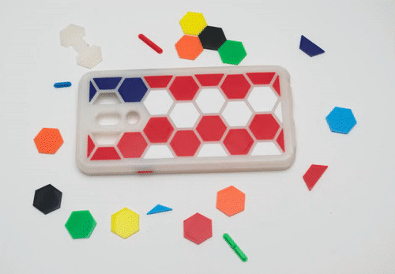
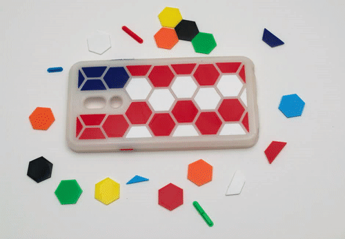

LG Stylo 5 Case Hex
===
Remix of this case [LG Stylo 5 Phone Case](https://www.thingiverse.com/thing:3903689) from formula13x.

Case for the LG Stylo 5 Phone
  * Hexagonal pattern to reduce filament, print time, and make installation easy
	* Snap fit removable cam cover / protector
	* Decorative tiles to mix and match design
	* Removable / changable buttons 

Cam Cover/Protector 
---

Decorative Tiles 
---

Changes
---
Alterations to the original file include: 
  - increasing the width and height by 0.4mm
  - adding hexagonal relief pattern
  - cam cover
	- decorative tiles

Credits
---
[Original case](https://www.thingiverse.com/thing:3903689)

Print Execution
---
When printing the main case it is recommended to set the xy support distance setting to at least 1.4mm, this will prevent supports from being printed under the phone retention lip. They are not needed here and this will speed cleanup while saving fittment. 

### Settings
| Print Setting | Value |
| --- | --- |
| Material | PLA |
| Layer Height | 0.2 |
| Supports | Everywhere |
| Support XY Distance | 1.4mm | 

Post Print / Prep
---
File is left slightly tight due to different printer calibration and shrinkage. Expect to spend a few minutes with some 220 sandpaper.
For me this was only the corners and top lip that needed a little reduction. 

### Supplies
220 Sandpaper

### Aseembly
Prefit all parts

**Double check the fit before inserting or you may have to cut the case to get it out.**

Recommend securring the buttons with tape to prevent cursing 

Insert the bottom first and gently fit the top corners over the phone. If you insert the top first and try to 'force' the bottom over the phone you will likely break the weak spot near the stylus. 
